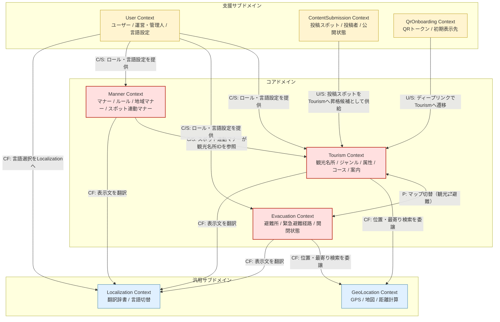

# 07 境界づけられたコンテキスト（初版ドラフト）

> **ステータス：初版ドラフト**
> 06 のヒアリングシートを起点に、ユビキタス言語 → 境界づけられたコンテキスト → コアドメイン/汎用サブドメインの分類を行うための「型枠」を作る。
> 詳細語彙（属性スキーマや状態遷移など）は今回スコープ外。あくまでコンテキストマップを描けるところまでが目的。

---

## 1. 設計のスタンス

- ヒアリング（06）で「採用」と明示された語彙を **ユビキタス言語の一次候補** とする。
- 同義に見える語は、まず文脈で意味が分離できるかを確認し、分離できない場合のみ「同一概念の別名」とする。
- 判断に迷うパラフレーズは **§3 の一階述語論理（FOL）スケッチ** で性質の差を明示し、差が無ければ統合する。
- このドキュメントは「定義の最終版」ではなく、**コンテキストマップを描くための骨格** である。

---

## 2. ユビキタス言語サマリ（コンテキスト割当ベース）

| 用語 | 意味（要約） | 所属コンテキスト（後述） |
| :--- | :--- | :--- |
| 観光名所 | 神戸市内のスポット。検索・案内の対象 | Tourism |
| ジャンル | スポットを大分類する「種別」（神社/レストラン等） | Tourism |
| 属性 | スポットに付随する補助タグ（近場/屋内/参拝可等） | Tourism |
| コース | 複数の観光名所を流れで巡る一連の案内 | Tourism |
| 案内 | 観光側のナビゲーション。サポート的ニュアンス | Tourism |
| マナー | 暗黙の了解として「周囲を不快にしないため」の振る舞い | Manner |
| ルール | 明示的に守らなければならない規範（マナーとは別物） | Manner |
| 地域マナー | 神戸市など地域に紐づくマナー（エレベーターの立ち位置等） | Manner |
| スポット連動マナー | 特定観光名所に紐づくマナー（神社の参拝の仕方等） | Manner（Tourismを参照） |
| 避難所 | 緊急時に逃げ込める場所（避難場所と同義扱い） | Evacuation |
| 緊急避難経路 | 緊急時の避難ナビゲーション。観光の「案内」とは別物 | Evacuation |
| 開閉状態 | 避難所が現在「開いているか」 | Evacuation（一次は静的データ） |
| 使用人数 | 避難所の現在の利用者数（実装可否は未定） | Evacuation（未確定） |
| お守り的な存在 | 平時の避難情報の見え方を表すメタ性質 | Evacuation（UI性質） |
| ユーザー | 外国人観光客（主要利用者） | User |
| 運営/管理人 | 観光名所・コース・マナー等のプリセット登録者 | User（管理権限） |
| ユーザー投稿 | 外国人ユーザー自身が場所情報を登録するCGM | ContentSubmission |
| 多言語 | 表示・案内・マナー文の翻訳 | Localization |
| 位置情報・地図 | GPS、マップ表示、距離計算 | GeoLocation |
| QR導線 | 観光案内所掲示のQRからの起動・初期案内 | QrOnboarding |

---

## 3. 判断に迷ったパラフレーズの一階述語論理スケッチ

ヒアリング上「どちらでもいい」「両方使う」と言われた語について、性質の差を式で明示する。
形式は厳密な証明ではなく、**差分の有無を可視化するためのスケッチ**。

### 3.1 「コース」 vs 「プラン」（Q5）

ヒアリング: 「プラン」も「コース」もあり得るが、ガチガチに決める計画＝プランの色、流れるように案内されるニュアンス＝コースの色がある。

```
∀x. Trip(x) ⇒ ∃S ⊆ Spot. |S| ≥ 2 ∧ Ordered(S, x)        -- 共通: 順序付きの複数スポット集合

Plan(x)    ≡ Trip(x) ∧ Fixed(Schedule(x))               -- 時刻ガチガチ
Course(x)  ≡ Trip(x) ∧ ¬Fixed(Schedule(x)) ∧ Suggested(x) -- 順序のみ提示
```

- 共通項: 「順序付きの複数スポット集合」
- 差分項: スケジュールが固定されているか／提示が示唆的か
- ヒアリング側コメント: 「言葉の定義に強いこだわりはない」「どちらも選び得る」

**結論（暫定）**: 同一エンティティを2つの呼称で呼んでいる状態。
本プロジェクトでは **`Course`（コース）を主呼称** として採用し、Plan は別名扱い（UI 上のラベルとして許容、ドメイン用語としては Course に統一）。

### 3.2 「ジャンル」 vs 「属性」（Q6）

ヒアリング: 分け方として「ジャンル」「属性」が挙がった。語感のニュアンスはあるが両方使われている。

```
∀s. Spot(s) ⇒ ∃!g. Genre(g) ∧ classify(s, g)            -- スポットは必ず1つのジャンルに属する
∀s. Spot(s) ⇒ ∃A ⊆ Attribute. tagged(s, A)              -- 属性は0〜多の集合
∀g. Genre(g) ⇒ ¬Attribute(g)                            -- ジャンルは属性ではない
```

- ジャンル: 単一所属の「大分類」
- 属性: 多重所属可能な「補助タグ」
- 差分項: カーディナリティ（1 vs N）と分類の主従

**結論**: 別概念。両方ユビキタス言語として採用。Tourism コンテキスト内に Genre と Attribute を共存させる。

### 3.3 「避難場所」 vs 「避難所」（Q8）

ヒアリング: Q8で両語が並列に出ているが、概念差の言及なし。

```
EvacuationShelter(x) ≡ Location(x) ∧ DesignatedForRefuge(x)
避難場所(x) ≡ EvacuationShelter(x)
避難所(x)   ≡ EvacuationShelter(x)
```

- 差分項: 検出されず（性質述語が同一）

**結論**: 同義語。主呼称は **`避難所`（EvacuationShelter）** に統一。

### 3.4 「案内」 vs 「経路」（Q4, Q11）

ヒアリング: 観光時は「案内」（サポート的）、避難時は「経路」「緊急避難経路」（堅めで明確）。

```
Guide(u, s)        ≡ User(u) ∧ Spot(s) ∧ Suggests(u, s) ∧ Supportive(Suggests)
Route(u, e)        ≡ User(u) ∧ EvacuationShelter(e) ∧ ShortestPath(u, e) ∧ Strict(ShortestPath)
∀u,s,e. Guide(u,s) ∧ Route(u,e) ⇒ context(Guide) ≠ context(Route)
```

- 差分項: 「サポート的」 vs 「指示的・最短経路」、所属ドメインが異なる

**結論**: 別概念。Tourism = `案内（Guide）` / Evacuation = `緊急避難経路（EmergencyRoute）` で完全分離。

---

## 4. 境界づけられたコンテキスト一覧

各コンテキストは「責務」「主要概念」「他コンテキストとの境界」を最小限に記す。

### 4.1 Tourism Context（観光コンテキスト）

- **責務**: 観光名所の検索・分類・案内、コースの提示
- **主要概念**: 観光名所 / ジャンル / 属性 / コース / 案内
- **境界**: 「マナー」は持たない（Manner Context が持つ）。位置検索の計算は GeoLocation に委譲。

### 4.2 Evacuation Context（避難コンテキスト）

- **責務**: 避難所情報の提供、緊急避難経路の提示、オフライン参照
- **主要概念**: 避難所 / 緊急避難経路 / 開閉状態 / （使用人数：未確定）
- **境界**: 観光の「案内」と語彙を共有しない（§3.4）。位置検索は GeoLocation に委譲。オフライン保存層は技術的詳細でドメインの外。

### 4.3 Manner Context（マナーコンテキスト）

- **責務**: マナーとルールの区別管理、地域マナーとスポット連動マナーの整理、啓発コンテンツ提示
- **主要概念**: マナー / ルール / 地域マナー / スポット連動マナー
- **境界**: 「スポット連動マナー」は Tourism の観光名所 ID を参照する（所有はしない）。

### 4.4 User Context（ユーザーコンテキスト）

- **責務**: 利用者（外国人観光客）と運営（管理人）の役割管理、言語設定の保持
- **主要概念**: ユーザー / 運営・管理人 / 言語設定
- **位置付け**: 認証は未確定（02/spec参照）。一次は「ロール概念」のみを置く。

### 4.5 ContentSubmission Context（ユーザー投稿コンテキスト）

- **責務**: 外国人ユーザーによる場所情報（例：公衆電話）の投稿・他ユーザーへの共有
- **主要概念**: 投稿スポット / 投稿者 / 公開状態
- **位置付け**: 初期リリース範囲は未確定（06 §次回深掘り 1）。Tourism と分離して持ち、必要に応じて Tourism に「昇格」できる形にする。

### 4.6 QrOnboarding Context（QR導線コンテキスト）

- **責務**: 観光案内所掲示のQRからの起動・初期案内、受付負担軽減
- **主要概念**: QRトークン / 初期表示先（コース or 観光名所）
- **境界**: Tourism にディープリンクするだけで、ドメインモデルは薄い。

### 4.7 Localization Context（多言語化コンテキスト）

- **責務**: 翻訳辞書の管理、言語切替の実行
- **位置付け**: ドメイン的にはどこにでもある汎用機能。i18next がそのまま境界の中身。

### 4.8 GeoLocation Context（位置情報コンテキスト）

- **責務**: GPS取得、地図表示、距離計算、現在地から最寄り検索
- **位置付け**: 観光・避難の両方から呼ばれる共有基盤。

---

## 5. コアドメイン / 支援サブドメイン / 汎用サブドメインの分類

01_overview の「神戸市限定 × 観光・防災・マナーの一体化」差別化方針と直接結びつくかどうかで分類する。

| コンテキスト | 区分 | 根拠 |
| :--- | :--- | :--- |
| **Tourism** | **コアドメイン** | 神戸特化の観光体験そのものが差別化要素 |
| **Evacuation** | **コアドメイン** | 地震未経験の外国人向け避難情報という独自価値 |
| **Manner** | **コアドメイン** | マナー啓発と他2機能の一体化が差別化軸 |
| User | 支援サブドメイン | 役割管理・言語設定はコアを「使えるようにする」役割 |
| ContentSubmission | 支援サブドメイン | コア観光情報を将来的に補強するCGM層 |
| QrOnboarding | 支援サブドメイン | 受付負担軽減という運用課題に直接効くが、差別化の源泉ではない |
| Localization | **汎用サブドメイン** | i18n は他アプリでも同形。差別化要素を含まない |
| GeoLocation | **汎用サブドメイン** | GPS/地図は汎用機能。神戸特化要素を含まない |

---

## 6. コンテキスト間の関係（コンテキストマップ）

関係性の凡例:

- **U/S (Upstream/Downstream)**: 上流が変わると下流が追従する関係
- **C/S (Customer/Supplier)**: 下流の要求が上流の優先度に影響する関係
- **CF (Conformist)**: 下流が上流のモデルにそのまま従う
- **P (Partnership)**: 双方が協調して進化させる
- **SK (Shared Kernel)**: 一部のモデル/語彙を共有
- **OHS (Open Host Service)**: 公開プロトコルで提供
- **ACL (Anti-Corruption Layer)**: 翻訳層で守る



---

## 7. オープンクエスチョン（次回ヒアリング候補）

§3 の FOL 分析では決着したが、設計上は別途確認したい点を列挙しておく。

1. **`Course` を主呼称に統一して問題ないか**
   UI 表示でも「コース」基調にしてよいか、もしくは英語UI上だけ "Plan" を残すなどの要望はあるか。
2. **「スポット連動マナー」のオーナーシップ**
   神社の参拝マナーなどは「マナー側が観光名所IDを参照する」前提で組んだ。逆に「観光名所の中にマナーが入っている」形を期待しているか。
3. **ContentSubmission の初期スコープ**
   初期リリースでユーザー投稿を含めるか、Tourism に「昇格」させる承認フローまで持つか。
4. **避難所の「開閉状態」「使用人数」のデータ源**
   静的データ／外部リンク誘導／システム保持のどれを基本線とするか。
5. **`Manner` と `Rule` を1コンテキスト内で持つか、別コンテキストに割るか**
   現状は同一コンテキスト内で型分離（区別はするが、扱いの近さから同じ境界）。明確に運用が分かれるなら分離する余地あり。
